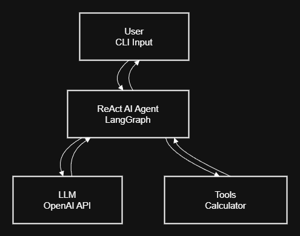

# Python AI Agent (LangChain + ReAct)

This project is a functional Python-based AI agent built using **LangChain**, **LangGraph**, and **OpenAI**.  
It provides a real-time, command-line chat interface and demonstrates how to implement a **ReAct-style agent** that can reason about user input and invoke tools when needed.

The agent is designed to be simple, extensible, and easy to understand, making it a strong foundation for more advanced AI agent systems.

---

## 🎯 Project Purpose

The goals of this project are to:

- Demonstrate how to build an AI agent using the ReAct pattern
- Enable natural language interaction via a CLI interface
- Show how tools can be integrated into agent reasoning
- Stream responses in real time for improved user experience
- Provide a clear, extensible agent architecture

---

## 🧠 How the Agent Works

The agent follows the **ReAct (Reason + Act)** paradigm:

1. The user provides input through the terminal
2. The LLM reasons about the intent of the input
3. The agent decides whether to respond directly or invoke a tool
4. Tool outputs are incorporated into the final response
5. The response is streamed back to the user in real time

LangGraph manages the ReAct execution flow, while LangChain provides abstractions for models, tools, and message handling.

---

## 🏗️ System Architecture

**System Architecture Overview**

This diagram illustrates the high-level architecture of the AI agent. The user interacts with the agent through a command-line interface. The agent coordinates reasoning using an OpenAI language model and can optionally invoke tools (such as a calculator) before returning responses to the user.

---

## 🛠️ Features

- Interactive CLI-based chat interface
- ReAct-style reasoning using LangGraph
- Tool support via LangChain decorators
- Streaming responses for conversational interaction
- Environment-based configuration using dotenv
- Minimal, readable, and extensible codebase

---

## 🧩 Example Tool: Calculator

The project includes a simple calculator tool that:

- Accepts two numeric inputs
- Performs basic arithmetic
- Returns results in natural language

This tool demonstrates how agents can decide when to act versus when to respond directly.

---

## 🛠️ Technology Stack

- **Python 3.10+**
- **LangChain**
- **LangGraph**
- **OpenAI API**
- **python-dotenv**

---
